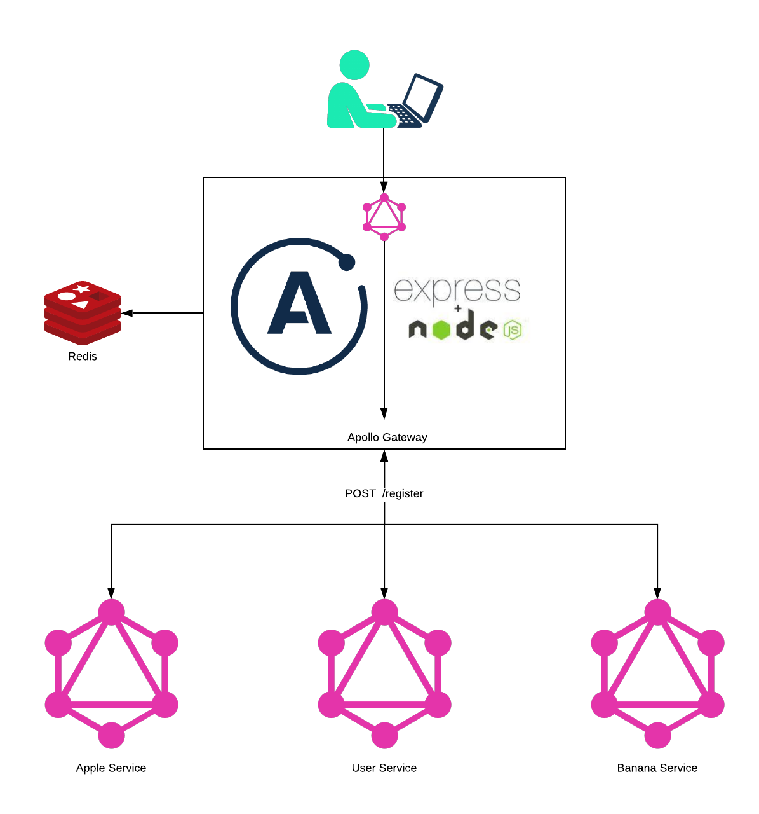
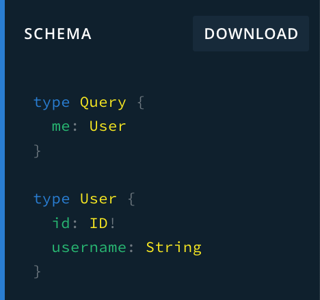
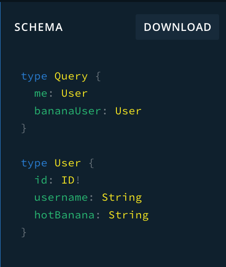

# POC: Federated GraphQL with Service Registry

This is a proof of concept, not intended for production use.

The goal of this application (i.e.: suite of apps) is to verify it's possible to hot-reload Apollo gateway service-list at runtime while still unmanaged. If this works it could allow downstream services to extend schemas of sibling federated resources after only reviewing it's schemas.

## GOAL

Prove it's possible to register multiple graphql apis together with apollo gateway during runtime using off-the-shelf opensource tech.



## TODO

- [x] Confirm hot reloading is possible.
- [ ] Identify error-surface when registering.
- [ ] Identify error-surface when de-registering.
- [ ] Unit-Test literally anything.
- [ ] Build any sort of deployment architecture.

## Get Started

1. Build the container. `docker build . -t federated-graphql:latest`.
> NOTE: The docker-compose mounts disk for all containers (except redis) right now to help support a tight development loop. This should be running on a webpacked/minified production build if it's ever distributed.
2. Boot up all apps by running `docker-compose up`
    - This will start-up the following services:
      - Redis
      - User-Service (registered by default)
      - Apple-Service (NOT registered yet)
      - Banana-Service (NOT registered yet)
3. Visit the exposed Gateway playground at [http://localhost:3000/graphql](http://localhost:3000/graphql) and notice that only the user service has registed it's schema:


3. Register the banana-service using the exposed expressJS /register route:

```bash
curl -X POST -H 'Content-Type: application/json' http://localhost:3000/register -d '{"name":"banana-user","url":"http://banana-service:3000"}'
```

1. Refresh the gateway playground page [http://localhost:3000/graphql](http://localhost:3000/graphql) and notice that the banana-service service has now registed it's schema:



1. Repeat to register the Apple-service.

## Questions Still On The Table

- Q: How/When does the gateway pull updated schemas from its services?
- A: There are experimental polling frequency configurations which allow this.
- Q: What happens when a service dies?
- A: Presumably the resolvers would fail and freak our. We may just wait for a failure to happen, then deregister it from the gateway. Still thinking.

## Deregistration

Deregistration is not implimented here yet, but the apollo docs allude to many ways to handle this, from polling services (apparently not recommended for production), to pub/sub style events. There are probably other built-in ways to keep t

## The Moving Parts

- Gateway
  - Exposes a single graphql API from which to query all resources, which may extend other resources
- Apple Service
  - Creates a new query and a schema which extends the user-system's `User` type.
- Banana Service
  - Creates a new query and a schema which extends the user-system's `User` type.
- Redis
  - Immediately consistent
  - Low latency
  - Storage
